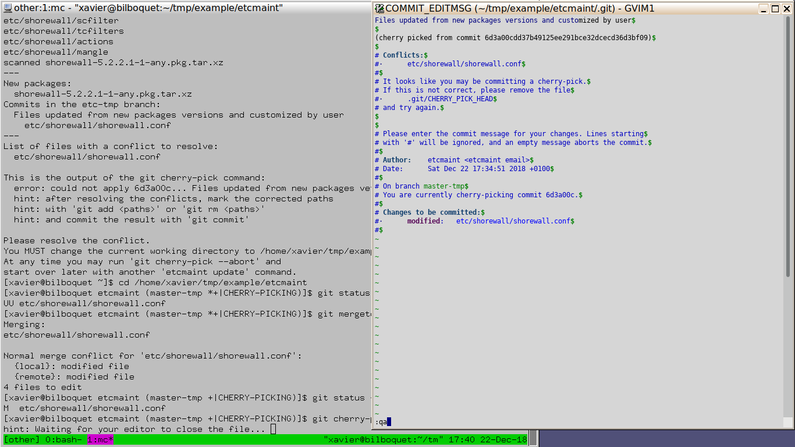

Git conflict resolution
=======================

This section demonstrates with an example how to resolve a Git conflict with
Vim.

Initial setup
-------------

* Customize the bash prompt by sourcing the ``git-prompt.sh`` script in
  ~/.bashrc.  The script is located in /usr/share/git/completion/ as well as
  the corresponding scripts for the other types of shell. The prompt will
  show:

    + The current branch name.
    + Whether there is any modified file (marked with ``*``) or any staged
      file (marked with ``+``).
    + When a conflict resolution session is being run.

* Configure Git with gvim as the text editor for use by Git commands::

    git config --global core.editor 'gvim -f'

* Configure Git with gvim as the merge tool::

    git config --global --add merge.tool vim-mergetool
    git config --global --add mergetool.keepBackup  false
    git config --global --add mergetool.vim-mergetool.trustExitCode true
    git config --global --add mergetool.vim-mergetool.cmd \
        'gvim -f -d -M -c "set modifiable write noreadonly" $MERGED $LOCAL $REMOTE $BASE'

.. _conflict-resolution:

Conflict resolution
-------------------

.. note::

   Remember that etcmaint uses *merge* in its documentation while it is a
   *cherry-pick* that the etcmaint implementation is actually doing.

In this example a single file named ``config.conf`` has been updated by the
user and upgraded by pacman. The changes made at the second line of the file
are in conflict. In the ``master`` branch it is::

  line 2 - edited by user

In the ``etc-tmp`` branch it is, after the pacman upgrade::

  line 2 - pacman upgraded

The following bash session resolves the conflict:

The next sections describe each command of this bash session.

Simulate an etcmaint cherry-pick
^^^^^^^^^^^^^^^^^^^^^^^^^^^^^^^^
The first command,
``git cherry-pick 1549fdedf3f217341fd773d8deabf3f013e62955``,
is actually run by etcmaint and the command is used here to emulate etcmaint
behavior for this simple example. Its output shows what to expect when the
cherry-pick fails in etcmaint.

The next prompt shows that we are on the ``master-tmp`` branch and
``*+|CHERRY-PICKING`` tells us we are about to resolve conflicts and that
there are modified and staged files. To know which files are in conflicts
run the status Git command::

  [xavier@bilboquet example (master-tmp *+|CHERRY-PICKING)]$ git status
  On branch master-tmp
  You are currently cherry-picking commit 1549fde.
    (fix conflicts and run "git cherry-pick --continue")
    (use "git cherry-pick --abort" to cancel the cherry-pick operation)

  Unmerged paths:
    (use "git add <file>..." to mark resolution)

          both modified:   config.conf

  no changes added to commit (use "git add" and/or "git commit -a")

The next command, ``git mergetool``, will start an instance of gvim for each
file that is in conflict (here we only have one).

Cancel the resolution on one file
^^^^^^^^^^^^^^^^^^^^^^^^^^^^^^^^^^

The ``git mergetool`` command starts a gvim instance with four buffers. The
leftmost one is the file to be merged in the ``master-tmp`` branch, i.e. the
result of the merge. This is the only buffer that is not readonly.

Git has inserted the ``<<< === >>>`` conflict markers at each location in the
file where there is a conflict.

The other three buffers are from left to right:

* The ``LOCAL`` buffer, the previous content of the file on the current
  branch.
* The ``REMOTE`` buffer, the content of the file on the ``etc-tmp`` branch.
* The ``BASE`` buffer, the content of the file on the common ancestor of both
  branches which is only really useful for Git merges and not for
  cherry-picks.

Here we decide to abandon the conflict resolution of this file by enterring
the ``:cquit`` Vim command to tell Git that the merge has failed. We could
then abort the cherry-pick with ``git cherry-pick --abort`` and start over
from scratch a new etcmaint session with the ``update`` etcmaint command.

Resolve the conflict on one file
^^^^^^^^^^^^^^^^^^^^^^^^^^^^^^^^

Instead of aborting the cherry-pick we decide to make another attempt and
issue a second ``git mergetool``. We fix the merge in the leftmost buffer
by keeping the lines from both branches and
save the result with the ``:wqa`` Vim command.

Commit the cherry-pick
^^^^^^^^^^^^^^^^^^^^^^

All conflicts are now fixed and the ``git cherry-pick --continue`` last
command spawns gvim to allow us, if necessary, to edit the commit message
which is the original message of the commit we are cherry-picking from.
It is safe to run cherry-pick with ``--continue`` when there are still
conflicts pending, the command exits with an explicit error message in that
case.

The ``update`` etcmaint command is now fully completed and changes made by
this command, including the cherry-pick, can now be checked with::

  git diff master...master-tmp

.. vim:sts=2:sw=2:tw=78
